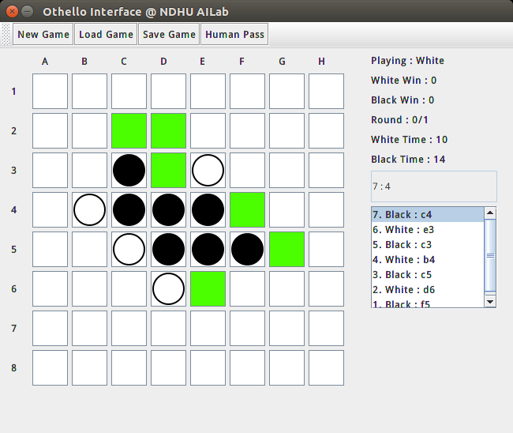
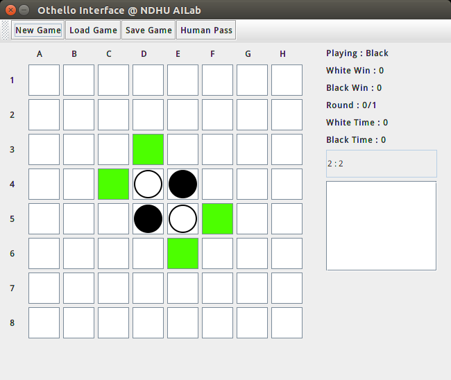
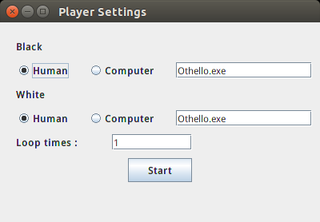

# Execute

```
javac OthelloGUI.java
jar cvfm OthelloGUI.jar manifest.txt -C . *.class *.png
```
To excute it, simply run

```
java -jar OthelloGUI.jar
```

### Shell Script for Linux
```
chmod a+x package.sh
sh package.sh
```

It will make package.sh excutable, use javac to generate java class files, and package class files to java runnable file.

# Panel Information



* Playing
* White Win, Black Win, Round *(Useful when both player are computer player)*
* White Time, Black Time *(Update when move finished)*
* Textarea - Black Stones : White Stones
* Move List

# First Start



# Player Settings



* Human
* Computer : Please fill the excutable file name in textbox.
* Loop times : Loop how many rounds that both computer player playing.

# Computer Player

Computer othello player should read file: "board.txt" every round.

An example context of board.txt:

```
f5f4g3e6d3e3f2c5e7f3c4g4h4h3g2h5b5e2e1h1h2g1h6c3b2
```

f5, f4 and g3... means the move of every round from the initial state. When a player passes at a round, the
GUI program will output -- (2 minus character) instead.

The computer player can check it is playing black or white from the board.txt because black player always
plays first.When computer player decides to output a move, it should output the move to move.txt.

For example move.txt:

```
h7
```
